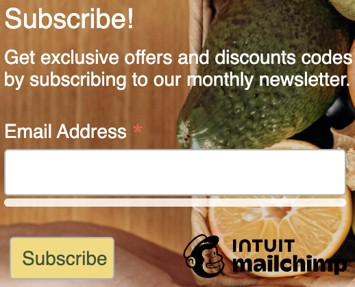

# FF2T - Fresh Farm 2 Table
### Where Freshness Comes to Your Doorstep

FF2T is a meticulously crafted web application using Django, designed for individuals who prioritize the freshness, authenticity, and sustainability of their food. Whether you're an advocate for locally sourced, organic produce or you're intrigued by the journey from farm to plate, FF2T simplifies your experience.

In a world where convenience often trumps healthy choices, FF2T stands as a beacon for those seeking health and convenience in harmony. Our platform bridges the gap between busy lives and nutritious living, offering you a curated selection of fresh produce delivered straight to your doorstep. Effortless, and eco-conscious!

- - -

## Table Of Contents
* [User Experience (UX)](#user-experience-ux)
  * [User Stories](#user-stories)
  * [Design](#design)
  * [Colour Scheme](#-colour-scheme)
  * [Typography](#-typography)
  * [Imagery](#-imagery)
  * [Wireframes](#-wireframes)
* [Agile Methodology](#agile-methodology)
* [Data Model](#data-model)
* [Features](#features)
  * [Header](#header)
  * [Home Page](#home-page)
  * [Footer](#footer)
  * [User Account Pages](#user-account-pages)
  * [My Profile Page](#my-profile-page)
  * [Products List](#products-list)
  * [Products Details](#products-details)
  * [My Favourite Products](#my-favourite-products)
  * [My Shopping Bag](#my-shopping-bag)
  * [Toast Messages](#messages-and-small-bag-display)
  * [Checkout Page](#checkout-page)
  * [Management Products](#management-products)
* [Future Features](#future-features)
* [Testing](#testing)

- - -

## User Experience (UX)

Fresh Farm 2 Table is a hub for a diverse community sharing a passion for fresh, sustainable, and mindful consumption. Our audience includes health advocates looking for nutrient rich diets, sustainability enthusiasts backing eco friendly farming, Families and Individuals valuing the convenience of doorstep delivery for fresh produce, freeing up time from grocery shopping, local community supporters fostering resilient food systems and culinary explorers experimenting with seasonal delights.

Here, these individuals unite to celebrate quality, health, and eco-friendly choices.

### User Stories

These user stories served as a starting point and can be expanded upon features implementations into the project. They help capture the primary functionalities and actions that users and administrators would expect from our e-commerce application.

**Viewing and Navigation** 

- As a Client, I can View a list of products, So I that can Select and explore the available options easily to meet my needs and preferences.
- As a Client, I can View individual product details, including descriptions, images and prices, So I that can Make informed purchasing decisions by accessing comprehensive information about each product.
- As a Client, I can Quickly identify deals and special offers, such as discounts, promotions, or bundled packages, So that I can Take advantage of saving opportunities by being informed about the latest deals.
- As a Client, I can View the total of my purchases at any time, So that I can Keep track of my expenses and budget effectively by easily accessing the total amount spent on purchases.

**Registration and User accounts**

-	As a Site User, I can Easily register for an account to have a personal account, So that I can Access personalised features and make use of the full functionality of the website.
-	As a Site User, I can Easily log in or log out to access my personal account, So that I can Securely access my account and manage my information and preferences.
-	As a Site User, I can Easily recover my password to access to my account, So that I can Regain access to my account in case I forget or lose my password.
-	As a Site User, I can Receive an email confirmation to verify my account, So that I can Ensure the security and validity of my account and protect against unauthorised access.
-	As a Site User, I can Have a personalised profile, So that I can view my personal order history, order confirmations and save my payment information to save time during the checkout process.
-	As a Site User, I can View and manage a list of my favourite products, So I that can Easily access them for future purchases.

**Sorting and Searching products**

-	As a Client, I can Sort a list of available products, So that I can Identify the best rated products, prices and easily sort products by categories to best meet my preferences and needs.
-	As a Client, I can Sort a specific category of products, So that I can Find the best-rated, best-priced, or alphabetically sorted products within that category.
-	As a Client, I can Sort multiple categories of products simultaneously, So that I can Find the best-priced products across various categories such as “FRESH HARVEST” and “FRESH FARM BOX”.
- As a Client, I can Search for a product by name or description, So that I can Quickly find specific products I'm interested in, saving me time and enhancing the overall shopping experience.
-	As a Client, I can Easily see what I've searched for and the number of results, So that I can Quickly decide on the most suitable options.

**Purchasing and checkout**

- As a Client, I can Easily select the quantity of a product while purchasing it So that I can Ensure I do not mistakenly choose the wrong quantity or product ensuring an accurate order.
- As a Client, I can View the items in my bag to be purchased So that I can Have a clear overview of the items in my bag, allowing me to review my purchase and confirm the total cost.
- As a Client, I can Adjust the quantity of individual items in my bag So that I can Easily make changes to my purchase before checkout, allowing me to fine-tune my purchase.
- As a Client, I can Easily enter my payment information So that I can Check out quickly, saving time and effort.
- As a Client, I can Feel that my personal and payment info are safe and secure So that I can Provide the information needed to make a purchase, ensuring the confidentiality and protection of my sensitive data.
- As a Client, I can View an order confirmation after checkout** So that I can Receive immediate feedback and confirmation of my order, allowing me to review the details and ensure the accuracy of my purchase.
- As a Client, I can Receive an email confirmation after checking out** So that I can Have a documented record of my order, accessible through email, for future reference or any necessary follow-up.

**Admin Stories**

- As an Admin, I can Add new products to the platform, So that I can Ensure that the selection is up-to-date and reflects the available offerings.
- As an Admin, I can Update or Edit products in the platform, So that I can Manage the product catalog effectively.
- As an Admin, I can Remove products from the platform, So that I can Manage the product catalog effectively.

### Design
Fresh Farm 2 Table is rooted in simplicity and friendly UI. Our interface has been meticulously crafted to facilitate seamless navigation, allowing users to effortlessly explore the application and concentrate on what truly matters. With a minimalist and intuitive layout, we've prioritized clarity and ease of use, ensuring that your journey through Fresh Farm 2 Table is both engaging and intuitive. 

Inspired by the exceptional design principles exemplified in projects like the [Boutique Ado](https://github.com/ckz8780/boutique_ado_v1) by Code Institute, we've crafted a platform that harmonizes aesthetics with functionality.

#### **-COLOUR SCHEME**

Color theme from Adobe Color

The color scheme of Fresh Farm 2 Table, inspired by the vibrant palette of bananas, has been meticulously choosen to infuse the platform with a sense of freshness, comfort, and organic vibrancy.

There are strong contrast between background colors and text throughout our web application, ensuring maximum readability and usability for all users.
 
#### **-TYPOGRAPHY**
 
Google Fonts was used to import the chosen fonts below for use in the application.

CSS rules to specify families

font-family: 'Lato', sans-serif; (main font)

font-family: 'Open Sans', sans-serif; (secondary font)

        
#### **-IMAGERY**

The homepage background image used within the site has been chosen from [pexel](https://www.pexels.com) taken by the photographer bellow:

Photo by: 

- [Mikhail Nilov](https://www.pexels.com/@mikhail-nilov/)

The Logo image used within the heading site has been taken from [Freesvg](https://freesvg.org/shopping-basket-vector-illustration)

The product imagery uploaded by the site admin comes from a Dataset from [Kaggle](https://www.kaggle.com)

#### **-WIREFRAMES**

Wireframes were created using [Figma](https://www.figma.com/)

Home Page - Desktop & Mobile

 )

Product List Page

 

Register My Account Page

 

Login Page

 

Logout Page

 

Product Details View Page

 

My Profile Page

 

My Favourite Page

 

My Shopping Bag Page

 

Checkout Secure Page

 

Checkout Success Page

 

## Agile Methodology

Github project was used to manage the development process of this project using an agile approach. 
Find the link to the Github project [here](https://github.com/users/Marcosmgs/projects/5/views/1) 

The  FF2T User Stories is documented within the Github project. A Github issue was created for each user stories and allocated to the Project. 
The user stories were moved accordingly the application was been built.  

## Data Model

In the Fresh Farm 2 Table project, the data model utilizes a set of function based views to efficiently manage various aspects of the application functionality. These views serve as the core logic for handling interactions with the data model. Each function view correspond to a specific user action, ensuring a organized structure.

[Django AllAuth](https://django-allauth.readthedocs.io/en/latest/) was used for user authentication. 
This powerful authentication system provides a seamless and secure user login and registration process, enhancing the overall user experience.

Category model serves as a fundamental building block, categorizing products and enabling easy navigation. With attributes name and friendly_name, this model ensures a structured representation of product categories, both internally and in the UI.

Product model is at the heart of the application, representing individual items available for purchase.
The is_favorited field, established as a Many-to-Many relationship with the User model, facilitates the tracking of users' favorite products.

UserProfile model extend the built-in User model provided by Django. This model provide an UX convenience by pre filling delivery information and connecting orders to user profiles.

Order model is central to the e-commerce. This model incorporates a unique order identifier generated using UUID, ensuring order differentiation. 
Complementing the Order model, the OrderLineItem model represents individual items within an order. This model calculates the total cost for each line item and adjusts the overall order total accordingly, ensuring accurate billing.

The ER diagram below shows the schemes for each of the models and how they are related.

Entity relationship diagram was created using [Figma](https://www.figma.com/).

## Features

#### **Header**

**- Deals Banner**
* The banner fixed-top positioning ensures that the message is displayed at the very top of every page.
* By displaying "Free delivery" offer throughout the application, users are consistently reminded of the benefit they can avail.
* Positively influence user behavior, prompting them to add more items to their bag to qualify for the promotion.

**- Header Bar**
* The header bar in FF2T provides convenient access to different sections of the web application
* The header bar is responsive and adapts to different screen sizes.

* On smaller displays, such as mobile devices, the header transforms navigation menu into a hamburger menu and turn the search bar into a collapsible navigation menu, ensuring easy navigation and saving valuable screen space.

* When user is logged in the header bar features my favourite functionallity for registered users.
* For superusers, the header includes an additional link for product management.

* The header begins with the branding element, featuring the application's logo and name
* Users can access their account related actions such as logging in, registering, viewing their profile, and managing their favorite products.
* header provides users with a summary of their shopping bag, including the total amount spend.

**- Search Bar**
* The header bar in FF2T provides convenient access to different sections of the web application.
* The search query is related with name and product description to ensure quality results.

**- Main Navigation Bar**
* Provides users with structured and easy access to all products sections and categories, ensuring efficient navigation and rifined exploration of content.
* By categorizing content and providing dropdown menus, users can easily navigate to the sections of the application that interest them, leading to more focused exploration.

* On smaller displays, such as mobile devices, the header transforms navigation menu into a hamburger menu, ensuring easy navigation and saving valuable screen space.
* Home Page link will be displayed in smaller screens to avail a back to landing page option in smaller screens.

#### **Home Page**

#### **- Landing Page**
* The hero image immediately captures users attention and conveys the core theme of fresh produce directly from the farm.
* "Quality & Freshness are here" This statement communicates the central value proposition of high-quality, fresh produce to customers.
* The "Shop Now" button serves as a clear and direct call to action, inviting users to explore the product offerings.

#### **- Newsletter**
* The addition of a newsletter subscription form expands interaction with users beyond their immediate visit.
* Subscribing users will receive exclusive offers and discount codes through your monthly newsletter as a sense of exclusivity and value.
* Newsletter subscription enhances engagement beyond the landing page visit, ensuring users continue to interact with FF2T.

#### **Footer**

* The footer section of FF2T is displayed across all web pages, providing important information and encouraging user engagement.
* Social media icons link to FF2T official social media pages, providing users with additional avenues to stay connected, receive updates, and access more content.
* The copyright information clearly communicates the ownership and rights associated with your application's content.

#### **User Account Pages**

Sign Up

 
 
 

Log In 

 
 
 

Log Out

 
 
 

#### **My Profile Page**

* The page starts with a form that allows users to update their default delivery information.
* This feature enables users to keep their delivery details up to date without needing to re enter them during every purchase.
* Allowing users to update their default delivery information ensures a user-friendly experience and encourages repeat purchases by eliminating the need to repeatedly input delivery details.
* Order history display, offers users a record of their past orders By offering an organized overview of previous orders, users can easily track their purchases and expenditures.

#### **Products Pages**

#### **Products List**
* The products list view page is where users can browse and explore the available products in your web application.
* It provides various features for sorting, filtering, and interacting with products.
* Each card displays product information including its image, name, price, and category.
* Users can click on a product card to view its details.

#### **- Product Count**

* The product counter display is a dynamic element that informs users about the total number of products currently being displayed on the page.
* It also provides contextual information when a search term is used to filter products.
* If a search term is provided, it also includes the search term in the display to provide context.

#### **- Filters Functionality**

* The filtering and sorting feature allows users to adjust the way products are displayed on the page.
* This is achieved through a dropdown menu containing sorting options, which users can select to change the order of product listings.
* Users can organize products in a way that suits their needs, whether by price, name, or category.

#### **- Product Tag**

* This tag is shown alongside the product name, price, and other details in both the products list view and the product details page.
* The category tags display provides users with a quick visual indication and access of the category to which a product belongs.

#### **- Back to Top**

* The "Back to Top" button in the bottom right corner provides users with a quick way to return to the top of the page.
* This button enhances user convenience, allowing them to easily navigate back to the top of the page without manual scrolling.

#### **Products Details**
* The product details view provides users with comprehensive information about a specific product.
* Users can effortlessly add products to the shopping bag or mark them as favorites.

#### **- Quatity Selector**

* The quantity selector functionality allows users to specify the quantity of a product they want to add to their shopping bag.
* The functionality includes buttons to increment and decrement the quantity, as well as restrictions to prevent selecting quantities below 1 or above 99.
* Changes to the quantity input field immediately reflect in the overall interaction.

#### **My Favourite Products**
* The favorite products page displays a list of products that the user has marked as their favorites.
* Users can click on the heart icon to toggle the product's favorite status. If a product is already a favorite, clicking the icon removes it from the favorites, and vice versa.

#### **- Remove Favourite**

* For each product, the page shows its image, name, price, and a heart icon that allows users to remove the product from their favorites.

#### **- Toggle My Favoutiter**

* A heart icon indicates whether the product is in the users favorites or not. If the product is a favorite, a filled heart is shown otherwise, an outline heart is displayed.

#### **My Shopping Bag**

* The shopping bag page displays a list of items that the user has added to their shopping bag.
* It provides information about each product, including its image, name, price, quantity, subtotal, and the total price of the bag.
* The page allows users to review the items and adjust it in their shopping bag before proceeding to checkout.
* If the user bag is empty, a message is displayed indicating that the bag is empty.
* Additionally, a button is provided for users to continue shopping or proceed to checkout.

#### **Messages and Small Bag Display**

* This functionallity provide toast messages for various types of messages, such as errors, warnings, and successes.
* This messages also provide a summary view of the products in the bag.
* The data-autohide="false" attribute is added to each toast, preventing them from automatically hiding. This allows users to dismiss the toast manually.
* Different colors and icons are used to visually distinguish between error, warning, success, and information messages.

#### **Checkout Page**
* Checkout page is where users can review their order, provide delivery and payment information, and complete the order process.
* The Order summary, It lists the items in the users bag along with their quantities, total and subtotal amounts.
* Delivery information form are displayed. There's also an option for users to save the delivery information in their profile.
* there is a loading overlay with a spinning icon to indicate that the page is processing something in the background.

#### **- Checkout Stripe**

* A Stripe card element is displayed for users to enter their payment details.
* The page loads the Stripe public key and client secret, which are used for processing payments securely.
* A separate JavaScript file (stripe_elements.js) handles the creation of Stripe elements and client side validation of the payment form. 
* Any form errors related to payment will be displayed in the card-errors div.

#### **- Checkout Success Page**

* A checkout success page displays after successfully completing an order. It displays order details and provides options for users to navigate back to their profile or explore more offers.
* This Checkout Success page provides users with an overview of their order details and confirms the successful completion of their order.

#### **Management Products**
* Allows superusers to add new products to the website.
* It utilizes a form to collect and display product information.

### **- Products CRUD**

* Enables superusers to edit existing products.
* Like the add product page, it utilizes a form to collect and display product information.
* The form fields are pre-populated with the existing product's details, which can be modified by the user. 

## Future Features

The following user stories were removed from the project as time was very short by the end of the project. The intentions are to implement it in the future.

* As a Site User I can give feedback messages so that My message can be displayed in the landing page.
* As a Site Admin I can approve or disapprove messages feedback so that I can moderate the content

## Web Marketing

#### **Bussiness Social Media Mockup Page**

Social Media

 
 
 

#### SEO Implementations

Business Model: B2C transactions. 
Business Idea: Fresh Farm 2 Table - Online Organic Produce Delivery
Introduction: Fresh Farm 2 Table is an innovative online platform that connects health conscious consumers with locally sourced, organic produce, delivered straight to their doorstep.

Our mission is to provide convenient access to fresh and sustainable food options, supporting local farmers and promoting healthy eating habits.

#### **- DEV-TEES KEYWORDS**

Short Tail Keywords:
* Fresh Organic Produce
* Farm to Table Delivery
* Sustainable Food Delivery
* Local Farm
* Organic Veg Box

Long Tail Keywords:
* Best Shop for Fresh Organic Produce Delivery
* Farm to Table Vegetable Delivery Service
* Sustainable and Locally Sourced Food Delivery
* Convenient Local Farm Fresh Produce Delivery
* Customizable Organic Veg Box Delivery

#### **Keyword Research Steps**

1. Brainstorm General Topics:
* Organic produce delivery
* Farm-to-table food delivery
* Sustainable food options
* Local farm products
* Customizable veg box
* Online fresh produce ordering
* Health-conscious meal planning
  
2. Brain Dump Possible Keywords for Each Topic:
* Organic vegetable delivery
* Farm-fresh produce delivery
* Sustainable food delivery services
* Local farm-to-table delivery
* Fresh organic fruits and veggies
* Custom organic veg box subscription
* Order local farm products online
* Healthy meal planning with fresh produce

3. Research Brain Dump of Ideas in Google Search:
* Conducted Google searches for each keyword phrase to identify related terms and phrases.
* Reviewed top search results to understand the context and competition for each keyword.

4. Selection of Short and Long-Tail Keywords:
5. Assess Your Choices for Relevance and Authoritativeness
* Checked if the selected keywords accurately reflect the business offerings.
* Verified that the keywords align with the target audience preferences and interests.
* Evaluated the competitiveness and potential reach of each keyword.

6. Digged into the Data Available on Keyword Volume and Competition:
* Utilized wordtracker.com to gather insights on keyword volume and competition.
* Analyzed trends to identify potential high-impact keywords.
* Adjusted keyword choices based on available data.

By following this keyword research documentation, I have effectively optimize the project content and enhance its discoverability.

## Testing
All of the information regarding the testing can be found [here](https://github.com/Marcosmgs/).

